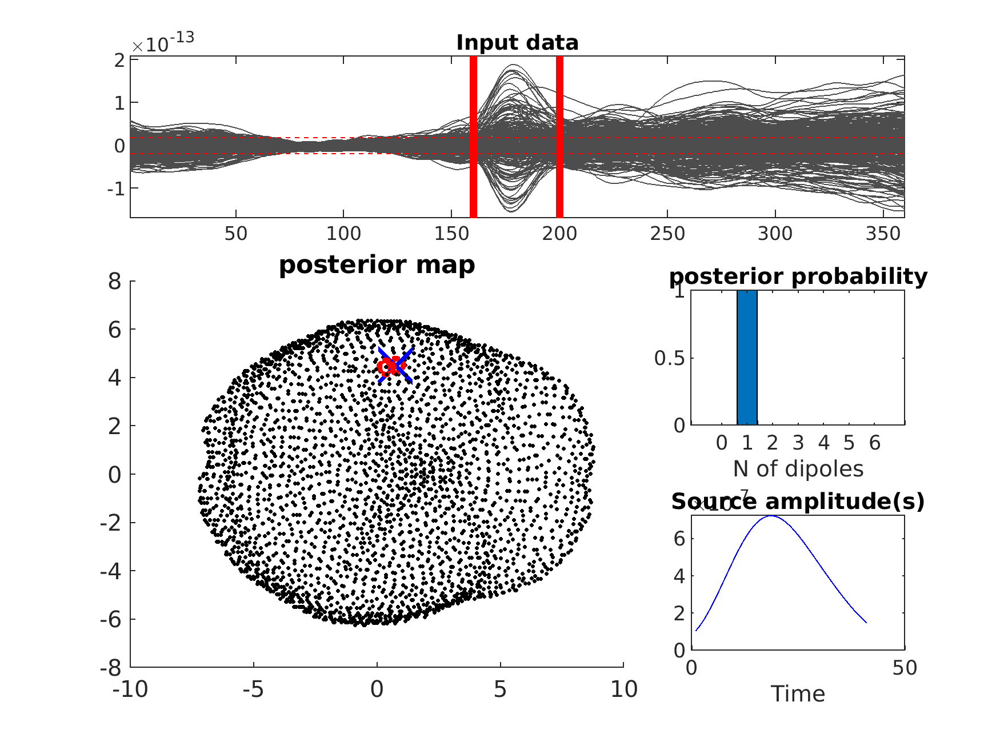

.. _example:

==========
Run SESAME
==========

This script runs the SESAME algorithm on the real somatosensory evoked field dataset described in the beamformer tutorial
of |Fieldtrip|.

The main **input** of the algorithm are the lead field, the source space and the data. The other parameters are optionals and
can be specified in the ``cfg`` variable. 

The output of SESAME, the ``posterior``, can be visualized by calling the :func:`inverse_SESAME_viewer` function which visualizes
the data with the time window analyzed, the posterior of the number of sources, the cortical posterior probability map condtioned on the number of estimated dipoles,
and the times series of the estimated dipoles.

.. |Fieldtrip| raw:: html

    <a href="https://www.fieldtriptoolbox.org/tutorial/beamformer_lcmv/" target="_blank">Fieldtrip</a>

.. code-block:: matlab

        clc

        %% Load sample variables:
        load('vars_for_SESAME.mat');

        %% set optional input parameters

        cfg.n_samples = 50; %number of samples

        cfg.t_start = 160; %initial time pont of the data
        cfg.t_stop = 200; %final time pont of the data

        cfg.evol_exp = 0; %number of iterations (if > 0), or adaptive number of iterations (if == 0)
        cfg.noise_std = 1.2e-13; %estimated noise on the data; if not specified it is self estimated by the algorithm
        cfg.verbose = true;

        %% run SESAME

        posterior = inverse_SESAME(data, LF, sourcespace, cfg);

        %% save result

        TIME = clock;
        save(strcat([date,'_',num2str(TIME(4)),num2str(TIME(5)),num2str(TIME(6)),'_SESAME.mat']),'posterior');

        %% visualization

        inverse_SESAME_viewer(posterior);

   Plot of the SESAME output provided by `inverse_SESAME_viewer` function
   
**Download** script: :download:`script_run_SESAME.m <../../script_run_SESAME.m>`

